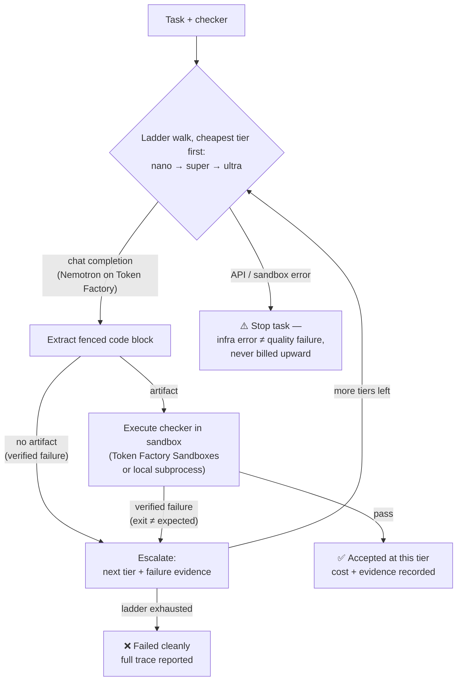

# nemocascade

**Execution-verified cost cascade for NVIDIA Nemotron models on Nebius Token Factory.**

nemocascade runs coding tasks through a cost-ordered ladder of Nemotron tiers
(nano → super → ultra). Every candidate answer is **executed in a sandbox**
(Nebius Token Factory Sandboxes, or a local subprocess backend) against the
task's checker. A cheap tier's answer is accepted the moment the sandbox says
it passes; the cascade escalates to a more expensive tier only on an
**execution-verified failure** — never on a guess.



## Why

Agent workloads mostly run on one model for every step, so either you pay
premium-model prices for trivial steps, or you risk cheap-model mistakes
reaching production. nemocascade makes the cheap tier the default and uses
**runtime verification** as the arbiter:

- **Verified quality** — an answer is only accepted when the checker exits
  green in the sandbox. The failure evidence (exit code, stderr) is real.
- **Escalation with receipts** — each retry prompt carries the previous
  tier's verified failure, so the stronger model fixes a concrete bug rather
  than re-rolling dice. The ladder escalates only on an execution-verified
  failure or a response without an executable artifact; infrastructure errors
  (HTTP failures, sandbox crashes) stop the task instead of escalating.
- **Quantified** — every run emits a JSON + Markdown report with per-tier
  call counts, token usage, and cost estimates, so cost/quality tradeoffs are
  measurable instead of anecdotal.

On the bundled demo suite the cascade solves 3/3 tasks while the cheapest tier
alone solves 1/3 — and the report shows exactly where the money went.

## Requirements

- Python 3.10+ (standard library only — no third-party dependencies)
- For live runs: a Nebius Token Factory API key (`NEBIUS_API_KEY`)
- For sandbox verification on Nebius: a Sandboxes-enabled project
  (`NEBIUS_IAM_TOKEN`, `NEBIUS_PROJECT`)

## Quickstart (no credentials — mock backend)

The repo bundles `devtools/mock_server.py`, an in-process mock of the Token
Factory chat API and the Sandboxes REST API with scripted Nemotron behaviors.
The mock runs real subprocesses, so verifier verdicts are honest:

```bash
git clone https://github.com/nikolas-sapa/nemocascade.git && cd nemocascade
python3 -m nemocascade.cli run --mock \
  --tasks tasks/tasks.json \
  --config config.example.json \
  --out report.json --md-out report.md
```

The CLI prints `MOCK backend` on stderr whenever the mock is in use — mock
runs are always labeled as such, and reports from mock runs are for
demonstration only.

## Live run on Nebius Token Factory

```bash
export NEBIUS_API_KEY=...            # from tokenfactory.nebius.com
export NEBIUS_IAM_TOKEN=...          # for Sandboxes
export NEBIUS_PROJECT=...            # your project id

python3 -m nemocascade.cli models                                   # discover ladder
python3 -m nemocascade.cli run \
  --tasks tasks/tasks.json \
  --config config.example.json \
  --sandbox nebius \
  --out report.json --md-out report.md
```

- **Chat** goes to `https://api.tokenfactory.nebius.com/v1/chat/completions`
  (OpenAI-compatible). Override with `--base-url` or `NEBIUS_BASE_URL`.
- **The ladder is discovered at runtime** from `GET /v1/models`: the first
  non-`-fast` Nemotron model matching each tier keyword (`nano`, `super`,
  `ultra`) is used, cheapest first. Pin exact ids via `--config`.
- **Verification** runs on Token Factory Sandboxes via the async ConTree
  contract — upload files (`POST /v1/files`), spawn a disposable instance
  (`POST /v1/instances`, operation id in the `Location` header), then poll
  `GET /v1/operations/<id>/subprocesses/1` until the subprocess result is
  ready. Use `--sandbox local` to verify locally instead — both backends
  speak the same contract and the whole test suite runs against either.

> **Security note:** the `local` backend executes model-generated code on the
> host with a scrubbed environment (no API keys or secrets are passed in), but
> it is **not** a security boundary — run untrusted tasks only where the host
> is disposable. The `nebius` backend executes in Nebius's VM-isolated
> sandboxes instead.

## Pricing honesty

`config.example.json` carries placeholder per-token prices. Real Token Factory
prices change over time; set `price_in_per_1m` / `price_out_per_1m` from
[current pricing](https://tokenfactory.nebius.com/models) before quoting cost
figures. With no prices configured, reports show token counts only and
explicitly say so — nemocascade never invents a dollar figure.

## Task suite format

Tasks are JSON (`tasks/tasks.json`). Each task has a prompt, the expected
solution path, a sandbox image, and a verifier:

```json
{
  "id": "balanced-brackets",
  "prompt": "Write solution.py implementing is_balanced(s) ...",
  "verify": {
    "command": ["python3", "check.py"],
    "files": {"check.py": "import solution\n..."},
    "expect_exit": 0,
    "stdout_regex": "^OK$",
    "timeout": 30
  }
}
```

Verifiers are plain executables — anything that can run in a sandbox works
(checkers, test suites, fuzzers). `tasks/tasks_negative.json` includes
deliberately unsolvable tasks to demonstrate clean failure reporting.

## What was tested where (honest scope)

- ✅ Full pytest suite (48 tests) against the in-repo mock, covering the
  Sandboxes async contract (upload → spawn → 425/200 polling), escalation
  paths, failure paths, auth handling, malformed-response robustness
  (`usage: null`, `content: null`, empty choices), and CLI end-to-end runs.
- ✅ The mock sandbox executes real subprocesses with a scrubbed environment,
  so canned wrong answers genuinely fail their checkers.
- ⏳ **Not yet exercised: any live Nebius endpoint.** The chat client targets
  the OpenAI-compatible `https://api.tokenfactory.nebius.com/v1` contract
  (low risk). The Sandboxes backend is implemented from the published API
  reference as of 2026-09-13 but has never talked to the real service — run
  the live smoke test in `SUBMISSION_CHECKLIST.md` before recording the demo
  or quoting live results. If the beta API has drifted, `NebiusSandbox` fails
  loudly (unexpected response shapes raise instead of guessing).

## License

MIT — see [LICENSE](LICENSE).
